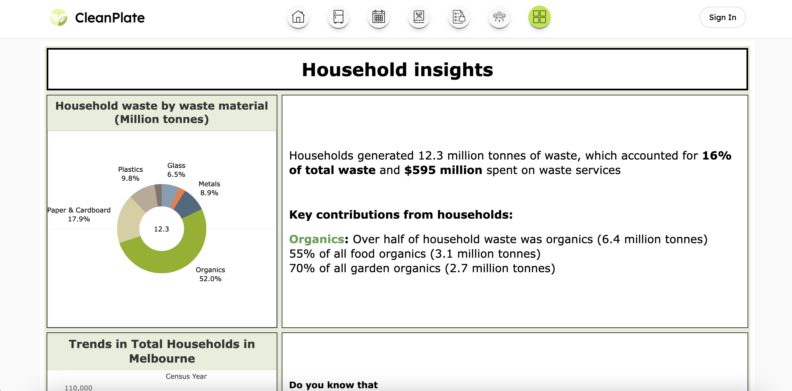
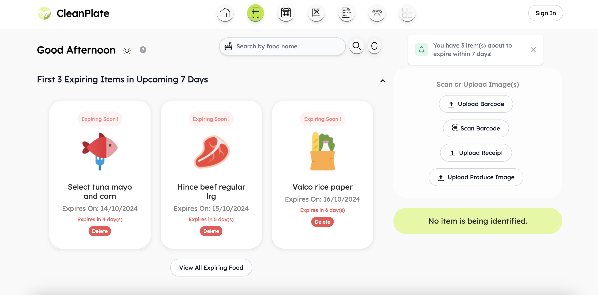
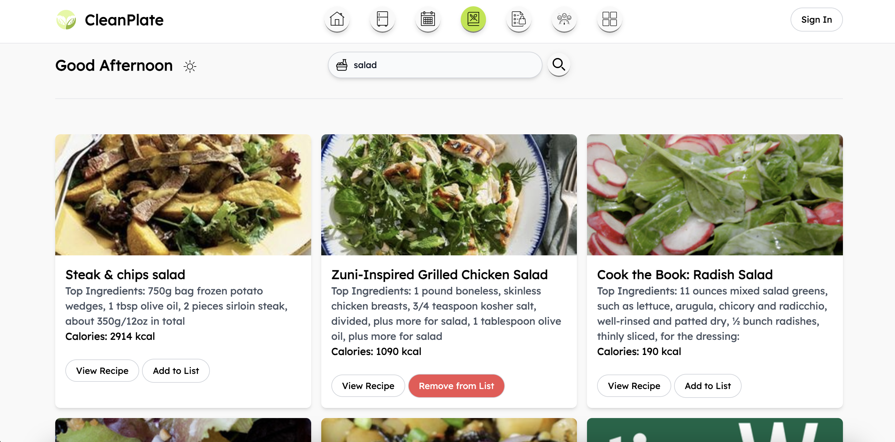
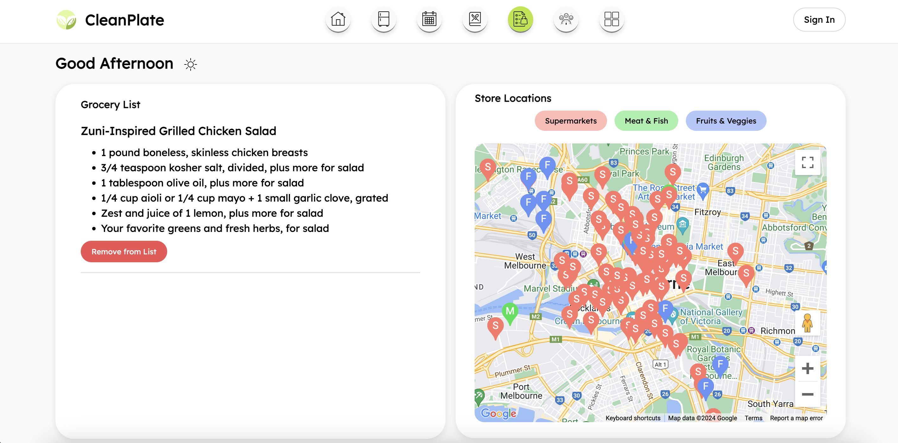

# CleanPlate

Monash University 2024 S2 Industry Experience
 
TA13 - Loading...

## What is the problem

Food waste has become an increasing concern in Victoria in recent years. A study conducted by Sustainability Victoria recorded over 2.4 million tonnes of food waste being thrown out from Victoria in 2020, which contributes to greenhouse gases emission (Sustainability Victoria, 2024). In terms of Melbourne, it recorded over 900,000 tonnes of edible food waste, and 2.5 million tonnes of greenhouse gases are generated from food waste (Foodprint Melbourne, 2018). The largest contributor of food waste is households, which are responsible for around 30% of the total ‌(DCCEEW, 2024). Despite there being existing resources targeted to prevent food waste, those resources are mostly text-based and lack engagement. Therefore, the existing resources could not effectively change their behaviours.

_**How can we create an engaging and educational platform that will change their behaviour towards food waste?**_

## Who are we targeting at?

Residential households - Young couples aged 45 or below with young children

## Solution

CleanPlate

- An web application designed to help users manage their food inventory, track food waste, and make better food choices.

## Features

- **Educative Dashboard**:
   
  Provides interactive dashboard that educates households on food waste. It will display a map of Melbourne showing food waste statistics and impacts, and offer strategies for reducing household food waste. The goal is to raise awareness and encourage sustainable practices.
    
  

- **Food Expiry Tracker**:
   
  Help users manage expiry dates of their food. Users can record their food products through barcode, receipts and an image of produce (fruits/ vegetables). It aims to reduce food waste through better meal planning and timely action.
    
  

- **Notifcation**:
   
  Provides a calender view about the number of items expiring and detailed lists of expiring items on specific dates, helping users, especially busy parents, to have an overview of expiring items and consume items before they spoil.
    
  

- **Recipe Searching**:
   
  Allows users find recipes based on ingredients that they already have at home. It helps prevent leftover ingredients from going to landfill directly, and minimise food waste.
    
  

- **Grocery Planning**:
   
  Helps busy parents purchase the right amount of food by providing a grocery planner that generates ingredient lists for shopping. It also assists users in quickly finding convenient places to buy groceries.
    
  

- **Wasted Food Scale**:
   
  Provids busy parents with an interactive tool to make sustainable decisions about leftover food and track their progress in reducing food waste.
    
  

- **Mobile Responsiveness**:
   
  This application has been designed to be used both on mobile devices and laptops. Users who signed up can access their data on difference devices, without concern of lossing their entries.

## Getting Started

### Prerequisites

- AWS account with Lambda and RDS services configured.
- Python 3.10 or higher.
- MySQL database setup on AWS RDS.

### Installation

1. Clone this repository
   https://github.com/ChuyingYuan/CleanPlate.git

2. Project SetUp
   Deploy the Lambda functions using AWS CLI or AWS Management Console. Ensure the environment variables are set correctly in the Lambda function configuration.

   Usage
   Invoke the Lambda functions via API Gateway.

3. Deployment
   Deploy the web application via AWS Amplify.
